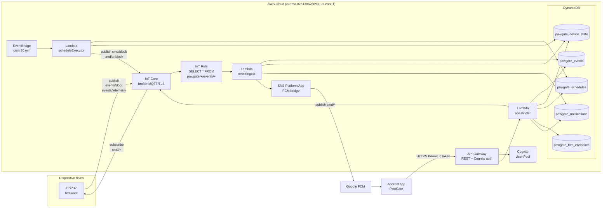

# PawGate — Arquitectura AWS (handoff)

Documento de bienvenida para el equipo. Asume **cero conocimiento previo de AWS**.
Cuenta AWS: **account ID `075138626693`**, región **`us-east-1`**.

---

## 0. Diagrama (Mermaid — GitHub lo renderiza automático)



---

## 1. Big picture

```
┌─────────────┐       MQTT/TLS (8883)     ┌─────────────────┐
│   ESP32     │ ◄──────────────────────► │  AWS IoT Core   │
│ (firmware)  │   topic events/door,      │  (MQTT broker)  │
│             │         cmd/+              │                 │
└─────────────┘                            └────────┬────────┘
                                                    │ "Rule" (SQL filter)
                                                    │ SELECT * FROM 'pawgate/+/events/+'
                                                    ▼
                                          ┌─────────────────────┐
                                          │ Lambda eventIngest  │
                                          │  - Guarda en DDB    │
                                          │  - Manda push (SNS) │
                                          └────────┬────────────┘
                                                    │
        ┌───────────────────────────────────────────┼────────────────┐
        ▼                                           ▼                ▼
┌──────────────────┐                       ┌──────────────────┐  ┌──────────────────┐
│   DynamoDB       │                       │ SNS Platform App │  │ pawgate_         │
│ pawgate_events   │                       │ (FCM bridge)     │  │ notifications    │
│ pawgate_state    │                       │                  │  │   (bandeja app)  │
│ pawgate_schedules│                       └────────┬─────────┘  └──────────────────┘
│ pawgate_fcm_     │                                │
│   endpoints      │                                ▼ push
│ pawgate_         │                       ┌──────────────────┐
│   notifications  │                       │ Google FCM       │
└──────────────────┘                       └────────┬─────────┘
        ▲                                           │
        │ HTTPS (REST)                              ▼ push notif
        │                                  ┌──────────────────┐
        │                                  │  Android app     │
┌───────┴────────┐                         │  PawGate         │
│ API Gateway    │ ◄────── HTTPS ────────► │                  │
│ + Lambda       │   (idToken Bearer)      │                  │
│ apiHandler     │                         │                  │
└───────┬────────┘                         └──────────────────┘
        │
        │ verifica token
        ▼
┌──────────────────┐
│ Cognito User Pool│
│ (login/signup)   │
└──────────────────┘

         ┌─────────────────────────────────────────┐
         │  EventBridge cron (cada 30 min)         │
         │  → Lambda scheduleExecutor              │
         │  → evalúa pawgate_schedules y bloquea/  │
         │    desbloquea automáticamente           │
         └─────────────────────────────────────────┘
```

**Resumen en una frase**: el ESP32 publica eventos a un broker MQTT, una regla
los desvía a una Lambda que los guarda en DynamoDB y opcionalmente manda push;
la app Android lee/escribe vía una API REST que también es una Lambda; el login
lo maneja Cognito; un cron evalúa horarios cada 30 min.

---

## 2. Componentes uno por uno

### 2.1 AWS IoT Core (broker MQTT)

**Qué es**: un servidor MQTT/TLS administrado por AWS. Acepta conexiones del
ESP32 vía mTLS (certificado en el device).

**Topic naming convention**:
```
pawgate/{thing_name}/cmd/+        # comandos que recibe el device (sub)
pawgate/{thing_name}/events/door  # eventos físicos (pub)
pawgate/{thing_name}/events/telemetry  # heartbeat + métricas (pub)
```

`thing_name` = `pawgate-001` (registrado en IoT Core con su cert).

**Cómo verificar**:
```bash
# Lista de "things" (devices) registrados
aws iot list-things --region us-east-1

# Subscribirse desde la consola para ver mensajes en vivo
aws iot-data start-mqtt-test --topic 'pawgate/+/events/+'    # no existe pero
# La forma correcta es ir a Console → IoT Core → Test → MQTT test client
```

**Si algo no anda**: el firmware no se conecta. Verificar `aws_certs.h` con
endpoint correcto, certs válidos, NTP sincronizado (TLS necesita hora).

### 2.2 IoT Rule (router de eventos)

**Qué es**: una regla con SQL que mira mensajes del broker y dispara acciones
(en nuestro caso, invocar una Lambda).

**Nuestra rule**:
- Nombre: `pawgate_events_rule`
- SQL: `SELECT *, topic() as topic, timestamp() as server_ts FROM 'pawgate/+/events/+'`
- Action: invocar lambda `pawgate-event-ingest`

**Cómo verificar**:
```bash
aws iot list-topic-rules --region us-east-1
aws iot get-topic-rule --rule-name pawgate_events_rule --region us-east-1
```

### 2.3 Lambda `pawgate-event-ingest` (consume eventos del firmware)

**Qué hace** (código en `Backend/lambdas/eventIngest/lambda_function.py`):
1. Recibe el evento del topic vía la rule.
2. Lo guarda en `pawgate_events` con `device_id` (PK) y `ts_event` (SK).
3. Si es telemetry, actualiza `pawgate_device_state.info` con el snapshot.
4. Si es notifiable (`opened`/`blocked`/`unblocked`/`light_on`/`light_off`):
   - Persiste 1 fila por user en `pawgate_notifications`.
   - Manda push vía SNS Platform App (si está configurada).

**Env vars importantes**:
- `EVENTS_TABLE` = `pawgate_events`
- `DEVICE_STATE_TABLE` = `pawgate_device_state`
- `NOTIFICATIONS_TABLE` = `pawgate_notifications`
- `FCM_ENDPOINTS_TABLE` = `pawgate_fcm_endpoints`
- `FCM_PLATFORM_APP_ARN` = ARN del SNS Platform App (sin esto, no manda push)

**Cómo deployar cambios**:
```bash
cd Backend/lambdas/eventIngest
zip -r ../eventIngest.zip lambda_function.py
aws lambda update-function-code \
  --function-name pawgate-event-ingest \
  --zip-file fileb://../eventIngest.zip \
  --region us-east-1
```

**Cómo ver logs**:
```bash
aws logs tail /aws/lambda/pawgate-event-ingest --region us-east-1 --since 5m
```

### 2.4 Lambda `pawgate-api-handler` (REST API)

**Qué hace** (código en `Backend/lambdas/apiHandler/lambda_function.py`):
expone los endpoints HTTP que consume la app Android. Cada request entra por
API Gateway con un `Authorization: Bearer <idToken>` que Cognito valida antes.

**Endpoints principales**:
```
POST /auth/signup                              # crear cuenta
POST /auth/confirm                             # confirmar email con código
POST /auth/login                               # devuelve idToken/refreshToken
POST /auth/refresh                             # renovar idToken vencido

GET  /devices/{id}/history                     # eventos del device
POST /devices/{id}/cmd/{cmd}                   # abrir/cerrar/bloquear...
GET  /devices/{id}/state                       # lock_state actual
POST /devices/{id}/state/override-block        # bloqueo manual con override
POST /devices/{id}/state/override-unblock      # desbloqueo manual con override
GET  /devices/{id}/info                        # telemetry del ESP32
GET  /devices/{id}/metrics/today               # aperturas + min de luz hoy

GET    /devices/{id}/schedules                 # CRUD horarios
POST   /devices/{id}/schedules
PUT    /devices/{id}/schedules/{schedule_id}
DELETE /devices/{id}/schedules/{schedule_id}

POST   /users/me/fcm-token                     # registrar token FCM (login)
DELETE /users/me/fcm-token                     # desregistrar (logout)
GET    /users/me/notifications                 # lista bandeja
GET    /users/me/notifications/unread-count    # badge del bell
POST   /users/me/notifications/read            # marcar todas leídas
POST   /users/me/notifications/{id}/read       # marcar una leída
```

**Cómo deployar**:
```bash
cd Backend/lambdas/apiHandler
zip -r ../apiHandler.zip lambda_function.py
aws lambda update-function-code \
  --function-name pawgate-api-handler \
  --zip-file fileb://../apiHandler.zip \
  --region us-east-1
```

### 2.5 Lambda `pawgate-schedule-executor` (cron de horarios)

**Qué hace**: cada 30 minutos un EventBridge dispara este lambda. Lee
`pawgate_schedules` y `pawgate_device_state`, evalúa si la hora actual cae
dentro de algún horario activo y publica `cmd/block` o `cmd/unblock` al
topic MQTT del device.

**Cómo verificar el cron**:
```bash
aws events list-rules --region us-east-1 --query 'Rules[?contains(Name,`pawgate`)]'
```

### 2.6 API Gateway

**Qué es**: el frontend HTTPS que recibe los requests del cliente y los
enrutea a la lambda `pawgate-api-handler`.

- REST API name: `pawgate-api`
- Base URL: `https://e6wp3s6rdf.execute-api.us-east-1.amazonaws.com/prod/`
- Authorizer: Cognito User Pool (valida el `Bearer <idToken>` en cada request
  excepto `/auth/*` que son públicos).

**Para agregar/cambiar rutas**: editar `Backend/setup-horarios-api.sh` o
`Backend/setup-15c.sh` y correrlos. Son idempotentes (no rompen lo que ya está).

### 2.7 Cognito User Pool (login/signup)

**Qué es**: AWS Cognito maneja autenticación. Cuando la app llama a
`/auth/signup`, el apiHandler invoca a `cognito.sign_up()`. Cognito guarda el
user y le manda un código por email.

**Token flow**:
1. `/auth/login` → devuelve `idToken` (válido 1h), `accessToken`, `refreshToken`.
2. Cada request a la API lleva `Authorization: Bearer <idToken>`.
3. Cuando `idToken` vence → la app llama `/auth/refresh` con el `refreshToken`
   para sacar un nuevo `idToken` sin re-loguear.

**User Pool ID**: lo encontrás con:
```bash
aws cognito-idp list-user-pools --max-results 10 --region us-east-1
```

### 2.8 DynamoDB (base de datos)

**Tablas**:

| Tabla | PK | SK | Para qué |
|---|---|---|---|
| `pawgate_events` | `device_id` (S) | `ts_event` (S) | Historial completo de eventos del firmware. TTL 90d via `ttl_epoch`. |
| `pawgate_device_state` | `device_id` (S) | — | Estado actual del device: `lock_state`, snapshot de telemetry en `info`. |
| `pawgate_schedules` | `device_id` (S) | `schedule_id` (S) | Horarios CRUD. |
| `pawgate_fcm_endpoints` | `user_email` (S) | — | Mapeo user → SNS endpoint ARN. Se llena en login (registrar FCM token). |
| `pawgate_notifications` | `user_email` (S) | `notif_id` (S) | Bandeja persistente de la app. TTL 30d via `ttl_epoch`. |

**Cómo ver el contenido**:
```bash
# Listar tablas
aws dynamodb list-tables --region us-east-1

# Ver últimos eventos de un device
aws dynamodb query --region us-east-1 --table-name pawgate_events \
  --key-condition-expression "device_id = :d" \
  --expression-attribute-values '{":d":{"S":"pawgate-001"}}' \
  --no-scan-index-forward --limit 5 \
  --query 'Items[].{event:event_type.S,at:created_at.S}'

# Ver state actual del device
aws dynamodb get-item --region us-east-1 --table-name pawgate_device_state \
  --key '{"device_id":{"S":"pawgate-001"}}'
```

### 2.9 SNS Platform Application + FCM (push notifications)

**Qué es**: cuando alguien instala la app, Firebase le da un "FCM token"
(string largo único por device). La app manda ese token al backend
(`POST /users/me/fcm-token`), que crea un "endpoint" en SNS Platform
Application. Cuando el lambda quiere mandar push, publica al endpoint ARN
y SNS se encarga de hablar con Firebase.

**Para que funcione necesita**:
- Una Platform Application creada en SNS (una vez), apuntando al server key
  del proyecto Firebase.
- Env var `FCM_PLATFORM_APP_ARN` en `pawgate-event-ingest` con el ARN.
- El archivo `google-services.json` en `Android/app/` (NO está en git,
  bajarlo de Firebase Console).

**Cómo verificar**:
```bash
aws sns list-platform-applications --region us-east-1
```

---

## 3. Cómo se conectan los pedazos en un flujo real

### Caso A: la mascota abre la puerta

```
1. ESP32: sensor RFID detecta animal → FSM transiciona a ABRIR_DESDE_AFUERA.
2. ESP32: publica {type: "opened", direction: "in"} al topic
   pawgate/pawgate-001/events/door.
3. IoT Core recibe el mensaje y la rule pawgate_events_rule lo matchea.
4. Rule invoca lambda eventIngest con el payload.
5. eventIngest:
    a. INSERT en pawgate_events.
    b. UPDATE pawgate_device_state.info (si era telemetry).
    c. Para cada user en pawgate_fcm_endpoints:
       - INSERT en pawgate_notifications con title "Puerta abierta hacia adentro".
       - sns.publish() al endpoint_arn → FCM → push al device.
6. App:
    a. PawGatePollingService cada 1-3s hace GET /devices/{id}/history → ve el opened.
    b. DoorStateMachine.onExternalDoorEvent("opened", "in") arranca ciclo UI.
    c. PawGateFcmService recibe el push (paralelo al polling) → mismo sync.
    d. Dashboard muestra "Abriendo hacia adentro → Abierta → Cerrando".
```

### Caso B: el user abre desde la app

```
1. App: POST /devices/pawgate-001/cmd/open con body {"direction":"in"}.
2. API Gateway valida el idToken con Cognito, invoca apiHandler.
3. apiHandler:
    a. iot_data.publish() al topic pawgate/pawgate-001/cmd/open.
    b. _audit_notify(actor, "cmd_open") → persiste notif "Vos abriste la puerta"
       en pawgate_notifications.
4. ESP32 recibe el cmd (suscripto a pawgate/+/cmd/+), abre el servo,
   publica {type: "opened", direction: "in"} al topic events/door.
5. Mismo flow que Caso A desde step 3, pero eventIngest detecta que hay un
   cmd_open reciente del mismo user (dedup 10s) y SKIPEA la notif duplicada.
```

---

## 4. Cómo deployar cambios típicos

### Cambiar código de una lambda
```bash
cd Backend/lambdas/<la-que-toques>
zip -r ../<nombre>.zip lambda_function.py
aws lambda update-function-code \
  --function-name pawgate-<nombre> \
  --zip-file fileb://../<nombre>.zip \
  --region us-east-1
```

### Agregar una ruta nueva a la API
Editar `Backend/setup-horarios-api.sh`, agregar el `ensure_resource` y
`ensure_method` correspondiente, y correr el script de nuevo.

### Crear una tabla DynamoDB nueva
Usar uno de los scripts existentes como referencia (ej.
`Backend/setup-notifications.sh`).

### Cambiar env vars de una lambda
**Cuidado**: `update-function-configuration` REEMPLAZA todas las env vars.
Primero leer las actuales:
```bash
aws lambda get-function-configuration --function-name pawgate-event-ingest \
  --region us-east-1 --query 'Environment.Variables'
```
Después pasarlas todas + la nueva:
```bash
aws lambda update-function-configuration --function-name pawgate-event-ingest \
  --region us-east-1 \
  --environment "Variables={KEY1=val1,KEY2=val2,...,NUEVA=val_nueva}"
```

---

## 5. Cómo debugar problemas comunes

### "El evento del ESP32 no llega al backend"
1. Verificar que el ESP32 esté conectado al broker (serial monitor debería
   decir `Conexión MQTT OK`).
2. Ver si la rule está activa:
   ```bash
   aws iot list-topic-rules --region us-east-1
   ```
3. Ver logs de eventIngest:
   ```bash
   aws logs tail /aws/lambda/pawgate-event-ingest --region us-east-1 --since 5m
   ```

### "La app dice 401 Unauthorized en todos los requests"
- El idToken venció (válido 1h). La app debería refrescarlo automáticamente
  vía `/auth/refresh`. Si no, deslogear + relogear.

### "Las push no llegan"
Ver `Backend/ARCHITECTURE.md#28-sns-platform-application--fcm` y el checklist
detallado en el handoff previo. Lo más común: falta `google-services.json` o
falta env var `FCM_PLATFORM_APP_ARN` en eventIngest.

### "Un evento del firmware aparece en DDB pero la app no lo muestra"
- La app pollea `/devices/{id}/history` cada 1-3s. Mirar logcat con filtro
  `tag:PollingSvc` para ver si está corriendo.
- Si el evento es muy viejo, el `lastDoorEventAt` de la app ya lo procesó.

---

## 6. Costos y Free Tier

Todo lo que usamos cae dentro del **Free Tier de AWS** asumiendo uso bajo
(1 device, ~10 users, ~100 events/día). Aproximación mensual:

| Servicio | Free tier | Estimado nuestro uso |
|---|---|---|
| IoT Core | 250k mensajes/mes | ~5k (1 device, ping cada 30s = 86k pero telemetry filter…) |
| Lambda | 1M invocaciones/mes | ~50k |
| API Gateway | 1M requests/mes (12 meses) | ~30k |
| DynamoDB | 25 GB + 25 WCU/RCU | <100 MB |
| Cognito | 50k MAU | <10 |
| SNS | 1M push/mes (mobile) | <500 |
| CloudWatch Logs | 5 GB/mes | <1 GB |

**Costo esperado: USD 0/mes** mientras estemos en estos órdenes. Si crece,
DynamoDB (PAY_PER_REQUEST) o API Gateway suelen ser los primeros en cobrar.

**Para monitorear**: AWS Console → Billing → Billing Dashboard. Tenemos
una alarma de billing seteada (Fase 12).

---

## 7. Setup desde cero (si hay que recrear todo)

En orden:

1. **Cuenta AWS + IAM user** (Fase 12, ya hecho).
2. **IoT Core**: registrar thing `pawgate-001`, crear cert + policy, bajar
   `config.json` + 3 archivos de cert (Fase 13). Setup en
   `Backend/Fase13_AWS_IoT_setup.md` si existe, sino consola AWS.
3. **DynamoDB tablas**: correr los scripts:
   - `Backend/setup-ddb-tables.sh` (events, schedules, device_state)
   - `Backend/setup-notifications.sh` (notifications, fcm_endpoints)
4. **Lambdas**: deployar las 3:
   - `pawgate-event-ingest`
   - `pawgate-api-handler`
   - `pawgate-schedule-executor`
   Con IAM roles que permitan acceso a DDB + IoT publish + SNS publish.
5. **IoT Rule**: crear `pawgate_events_rule` apuntando a `eventIngest`.
6. **Cognito User Pool**: setup con `Backend/setup-15c.sh`.
7. **API Gateway**: setup con `Backend/setup-horarios-api.sh` (idempotente).
8. **SNS Platform App**: crear en consola apuntando al server key del
   proyecto Firebase, configurar `FCM_PLATFORM_APP_ARN` en eventIngest.
9. **EventBridge cron**: setear el rule de 30 min apuntando a
   `pawgate-schedule-executor`.

---

## 8. Archivos clave del repo para conocer

```
Backend/
├── lambdas/
│   ├── eventIngest/lambda_function.py     # consume eventos firmware
│   ├── apiHandler/lambda_function.py      # REST API completa
│   └── scheduleExecutor/lambda_function.py # cron horarios
├── setup-*.sh                              # scripts idempotentes para configurar AWS
├── ARCHITECTURE.md                         # este archivo
└── iam-roles/                              # IAM policies referenciadas
```

```
Embebido/
├── src/main.cpp                            # firmware ESP32
├── src/aws_certs.h                         # certs (NO commit, está en .gitignore)
└── src/aws_certs.h.example                 # template
```

```
Android/app/src/main/java/com/unlam/pawgate/
├── api/
│   ├── PawGateApi.java                     # interface Retrofit
│   ├── DeviceRepository.java               # wrappers de /devices/*
│   ├── AuthRepository.java                 # /auth/*
│   ├── NotificationRepository.java         # /users/me/notifications/*
│   └── AuthInterceptor.java                # auto-refresh idToken
├── PawGateFcmService.java                  # recibe push FCM
└── PawGatePollingService.java              # foreground service que pollea backend
```

---

## 9. Contactos / responsables

- AWS account owner: **Fede Martucci** (federicoamartucci@gmail.com)
- Firmware: equipo
- Backend: equipo
- App: equipo

Si hay que rotar credenciales AWS, contactar al owner. **Nunca pushar
credenciales al repo** (`aws_certs.h`, `google-services.json` y similares
están en `.gitignore`).
