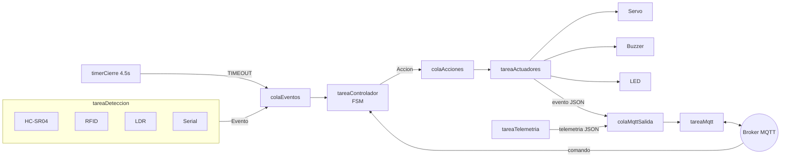
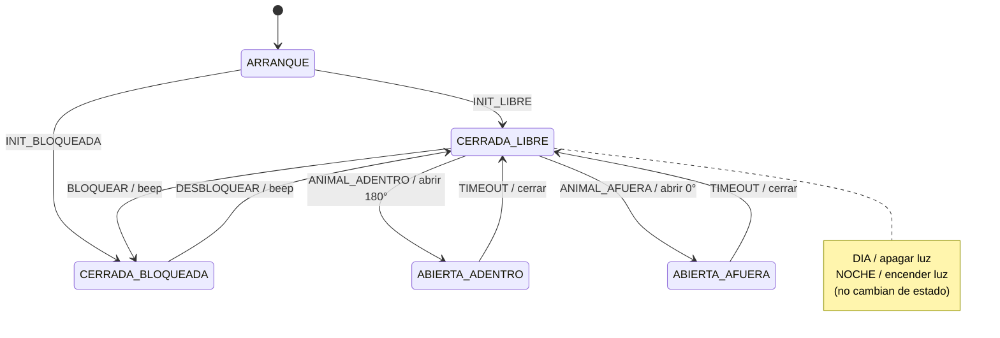

# PawGate — Puerta inteligente para mascotas (ESP32 / FreeRTOS)

Firmware de una puerta automática para mascotas sobre **ESP32**, desarrollado con
**Vibecoding Total** (código generado por IA). Detecta al animal con sensores, abre/cierra
la puerta con un servo, prende una luz de noche, y se controla y monitorea por **WiFi/MQTT**.

Esta es la versión **con IA**: toda la lógica se unifica en **una sola máquina de estados
dirigida por datos** (una tabla `[estado][evento] → {estado_siguiente, acción}`), corriendo
sobre tareas y colas de **FreeRTOS**.

> Documentos relacionados: [`README-proyecto-con-IA.md`](README-proyecto-con-IA.md) (informe del
> proceso de IA) y [`README-metricas-vscode.md`](README-metricas-vscode.md) (métricas de CPU/memoria).
> Este README explica **cómo funciona el código**.

---

## 1. Hardware

Pines definidos en [`src/main.cpp`](src/main.cpp) (namespace `Pin`) — deben coincidir con
[`diagram.json`](diagram.json):

| Componente | Pin | Rol |
|---|---|---|
| LED (luz) | 25 | Actuador — luz nocturna |
| LDR (fotoresistor) | 35 | Sensor de luz (ADC) |
| Buzzer | 4 | Actuador — sonidos de bloqueo/llamada |
| Servo | 12 | Actuador — apertura/cierre de la puerta |
| HC-SR04 TRIGGER / ECHO | 5 / 34 | Sensor de proximidad (ultrasonido) |
| RFID MFRC522 (SS/SCK/MOSI/MISO/RST) | 21/18/23/19/22 | Lector de tag (SPI) |

---

## 2. Arquitectura de software

El sistema usa **5 tareas de FreeRTOS** que se comunican por **3 colas** y un **timer**. Nadie
toca el hardware de otra tarea: los datos fluyen en una sola dirección (sensores → eventos →
FSM → acciones → actuadores).



| Tarea | Período | Qué hace |
|---|---|---|
| `tareaDeteccion` | 200 ms | Lee serial, HC-SR04, RFID y LDR → encola **eventos** |
| `tareaControlador` | 200 ms | Saca un evento, lo aplica a la **tabla FSM** → encola **acciones** |
| `tareaActuadores` | 200 ms | Saca una acción → mueve servo/buzzer/LED y publica eventos MQTT |
| `tareaMqtt` | 200 ms | Mantiene la conexión, recibe comandos y drena la cola de salida |
| `tareaTelemetria` | 30 s | Publica el estado del dispositivo (heap, RSSI, IP, etc.) |

Todas las tareas usan prioridad 1 y stack de 8192 bytes. Las esperas son **no bloqueantes**
(`vTaskDelay`), así ninguna tarea acapara el CPU.

---

## 3. La máquina de estados (dirigida por datos)

En vez de `if/switch` o punteros a función, las transiciones viven en una **tabla**
(`TABLA[estado][evento]`). Cada celda dice **a qué estado ir** y **qué acción emitir**; una
celda vacía (`X`) ignora el evento.

**Estados:** `ARRANQUE`, `CERRADA_LIBRE`, `CERRADA_BLOQUEADA`, `ABIERTA_AFUERA`, `ABIERTA_ADENTRO`.



Detalle de la tabla (evento → estado siguiente / acción):

| Estado actual | Evento | Estado siguiente | Acción |
|---|---|---|---|
| ARRANQUE | INIT_LIBRE | CERRADA_LIBRE | — |
| ARRANQUE | INIT_BLOQUEADA | CERRADA_BLOQUEADA | — |
| CERRADA_LIBRE | ANIMAL_ADENTRO | ABIERTA_ADENTRO | ABRIR_ADENTRO (servo 180°) |
| CERRADA_LIBRE | ANIMAL_AFUERA | ABIERTA_AFUERA | ABRIR_AFUERA (servo 0°) |
| CERRADA_LIBRE | BLOQUEAR | CERRADA_BLOQUEADA | BLOQUEAR (beep ↓) |
| CERRADA_LIBRE | DIA / NOCHE | *(sin cambio)* | APAGAR_LUZ / ENCENDER_LUZ |
| CERRADA_BLOQUEADA | DESBLOQUEAR | CERRADA_LIBRE | DESBLOQUEAR (beep ↑) |
| CERRADA_BLOQUEADA | DIA / NOCHE | *(sin cambio)* | APAGAR_LUZ / ENCENDER_LUZ |
| ABIERTA_AFUERA / ABIERTA_ADENTRO | TIMEOUT | CERRADA_LIBRE | CERRAR (servo 90°) |

Notas de diseño:

- **Luz como evento + acción:** día/noche son **eventos** (`DIA`/`NOCHE`) y la luz es una
  **acción** (`ENCENDER_LUZ`/`APAGAR_LUZ`), todo dentro de la misma FSM (no hay una segunda
  máquina de estados para la luz).
- **Arranque por la propia FSM:** `setup()` encola `INIT_LIBRE` (o `INIT_BLOQUEADA` si se
  define `INICIO_BLOQUEADO`), en vez de fijar el estado a mano.
- **`deteccionHabilitada`:** mientras la puerta está abierta los sensores se ignoran; se
  rehabilitan al cerrar. Así no se reabre sobre sí misma.

---

## 4. Flujos principales

- **Animal detectado (proximidad o RFID):** estando en `CERRADA_LIBRE`, el HC-SR04 (distancia
  < 30 cm) o el RFID encolan un evento → la FSM abre la puerta con el servo, arranca el
  **timer de cierre (4.5 s)** y publica `opened` por MQTT. Al vencer el timer se encola
  `TIMEOUT` → se cierra y se publica `closed`.
- **Luz automática:** la lectura del LDR se compara contra `UMBRAL_LUZ` (2048) con **detección
  por flanco** (solo al cambiar día↔noche, estando la puerta cerrada). De noche enciende el LED;
  de día lo apaga.
- **Bloqueo/desbloqueo:** por MQTT (`block`/`unblock`) o por serial (`B`/`D`). Bloqueada, la
  puerta ignora la detección de animales hasta desbloquear. Cada cambio suena un beep
  (descendente al bloquear, ascendente al desbloquear).

---

## 5. Interfaz MQTT

Broker público **HiveMQ** (`broker.hivemq.com:1883`, sin TLS) para poder simular en Wokwi sin
depender de la nube. La estructura de tópicos y los payloads JSON son **idénticos** a la versión
sin IA (que corre contra AWS IoT Core), así el mismo cliente/app sirve para ambas.

**Comandos** (se suscribe a `pawgate/pawgate-001/cmd/+`):

| Tópico | Payload | Efecto |
|---|---|---|
| `pawgate/pawgate-001/cmd/open` | `{"direction":"in"}` o `{"direction":"out"}` | Abre la puerta (in → servo 0° · out → servo 180°) |
| `pawgate/pawgate-001/cmd/block` | — | Bloquea la puerta |
| `pawgate/pawgate-001/cmd/unblock` | — | Desbloquea la puerta |
| `pawgate/pawgate-001/cmd/call` | — | Llama al animal (5 beeps, no cambia de estado) |
| `pawgate/pawgate-001/cmd/cancel` | — | Sin efecto sobre la puerta |
| `pawgate/pawgate-001/cmd/reboot` | — | Reinicia el ESP32 |
| `pawgate/pawgate-001/cmd/metrics` | — | Cierra el muestreo de métricas e imprime promedios (caso B) |

**Eventos publicados** en `pawgate/pawgate-001/events/door`:

```json
{ "type": "opened", "direction": "in", "ts": 12345 }
```
`type` ∈ `opened` / `closed` / `blocked` / `unblocked` / `light_on` / `light_off`.

**Telemetría** cada 30 s en `pawgate/pawgate-001/events/telemetry`: uptime, RSSI, heap libre/total,
flash, temperatura interna, IP, MAC, SSID, etc.

### Cómo probar MQTT

No hace falta la app Android ni instalar nada: alcanza con el **cliente web de HiveMQ**
(<https://www.hivemq.com/demos/websocket-client/>), que se conecta al mismo broker que el firmware.

#### Paso 1 — Compilá y levantá el firmware en Wokwi

**Primero compilá** el proyecto:

```bash
pio run
```

Después corré la simulación en Wokwi (extensión de VS Code; usa `wokwi.toml` + `diagram.json`).
Wokwi-GUEST da internet, así que el ESP32 alcanza el broker público. En el monitor serial tenés
que ver:

```
[mqtt] conectando...Conexión MQTT OK
[mqtt] suscripto a pawgate/pawgate-001/cmd/+
```

No sigas hasta ver el `Conexión MQTT OK` (sin internet en la sim, MQTT no conecta).

#### Paso 2 — Connection (conectá el cliente web al broker)

En <https://www.hivemq.com/demos/websocket-client/>, sección **Connection**, completá y dale
**Connect**:

| Campo | Valor |
|---|---|
| **Host** | `mqtt-dashboard.com` |
| **Port** | `8884` |
| **SSL** | ✅ activado |
| **ClientID** | el autogenerado |
| **Username / Password** | vacíos |
| **Path** (si aparece) | `/mqtt` |

> **Por qué 8884 + SSL:** la página carga por `https://`, y un navegador **bloquea** WebSocket sin
> cifrar (`ws://`, puerto 8000) desde una página https (regla de *mixed content*). Por eso se usa
> WebSocket seguro (`wss://`, puerto **8884**) con SSL activado. Síntoma típico de equivocarse de
> puerto: `Connect failed: AMQJSC0001E Connect timed out`.
>
> `mqtt-dashboard.com` y `broker.hivemq.com` son el **mismo** broker público de HiveMQ. No te
> confundas con los puertos: el **firmware** se conecta por TCP plano al **1883**, y **vos desde el
> navegador** por WebSocket seguro al **8884** — son dos vías de transporte al mismo broker, así que
> se ven los mensajes entre sí.

#### Paso 3 — Subscriptions (suscribite a lo que publica la puerta)

En **Subscriptions** → *Add New Topic Subscription*, agregá estas suscripciones (todas con
**QoS 0**):

| Topic | Qué trae |
|---|---|
| `pawgate/pawgate-001/events/door` | Eventos de la puerta (opened, closed, blocked, unblocked, light_on/off) |
| `pawgate/pawgate-001/events/telemetry` | Telemetría del dispositivo cada ~30 s |

> Atajo: en vez de las dos, podés suscribirte a una sola con comodín:
> `pawgate/pawgate-001/events/#` (cubre ambas).

Desde acá, todo lo que publique la puerta aparece abajo en **Messages**. A los ~30 s ya deberías
ver llegar solo un evento de **telemetría** (mensaje real recibido en `events/telemetry`):

```json
{"type":"telemetry","ts":64321,"uptime_s":64,"rssi_dbm":-64,"free_heap_kb":172,"total_heap_kb":322,"flash_used_kb":960,"flash_total_kb":4096,"cpu_temp_c":-17.77778,"local_ip":"10.13.37.2","device_mac":"24:0A:C4:00:01:10","firmware_version":"1.0.0","hardware_model":"ESP32-WROOM-32","wifi_ssid":"Wokwi-GUEST","wifi_bssid":"42:13:37:55:AA:01","wifi_band":"2.4 GHz","wifi_gateway":"10.13.37.1","wifi_security":"WPA2-PSK"}
```

> El `cpu_temp_c` da un valor fijo raro (≈ −17.8 °C) en Wokwi: el simulador no emula el sensor de
> temperatura interno del ESP32. En hardware real daría una temperatura coherente.

#### Paso 4 — Publish (mandá comandos a la puerta)

En **Publish**, para cada comando completá **Topic**, dejá **QoS** en `0`, **NO marques Retain**, y
poné el **Message** indicado. Después dale *Publish*. Un ejemplo por cada tópico existente:

**1) Abrir hacia adentro (servo 0°)**
- **Topic:** `pawgate/pawgate-001/cmd/open` · **QoS:** `0` · **Retain:** ❌
- **Message:**
  ```json
  {"direction":"in"}
  ```

**2) Abrir hacia afuera (servo 180°)**
- **Topic:** `pawgate/pawgate-001/cmd/open` · **QoS:** `0` · **Retain:** ❌
- **Message:**
  ```json
  {"direction":"out"}
  ```

**3) Bloquear la puerta**
- **Topic:** `pawgate/pawgate-001/cmd/block` · **QoS:** `0` · **Retain:** ❌
- **Message:** *(vacío)*

**4) Desbloquear la puerta**
- **Topic:** `pawgate/pawgate-001/cmd/unblock` · **QoS:** `0` · **Retain:** ❌
- **Message:** *(vacío)*

**5) Llamar al animal (5 beeps)**
- **Topic:** `pawgate/pawgate-001/cmd/call` · **QoS:** `0` · **Retain:** ❌
- **Message:** *(vacío)*

**6) Cancelar (sin efecto sobre la puerta)**
- **Topic:** `pawgate/pawgate-001/cmd/cancel` · **QoS:** `0` · **Retain:** ❌
- **Message:** *(vacío)*

**7) Cerrar el muestreo de métricas (caso B — imprime promedios CPU/mem en el serial)**
- **Topic:** `pawgate/pawgate-001/cmd/metrics` · **QoS:** `0` · **Retain:** ❌
- **Message:** *(vacío)*

**8) Reiniciar el ESP32**
- **Topic:** `pawgate/pawgate-001/cmd/reboot` · **QoS:** `0` · **Retain:** ❌
- **Message:** *(vacío)*

> ⚠️ **No marques Retain** al publicar comandos: un comando retenido queda guardado en el broker y
> se re-entrega a cada reconexión del ESP32, disparando la acción sola. Los comandos van siempre
> sin retain.

Al publicar `cmd/open`, en *Messages* ves llegar los **eventos reales** que devuelve la puerta
(tópico `events/door`), y la puerta cierra sola a los ~4.5 s:

```json
{"type":"opened","direction":"out","ts":1782616449432}
{"type":"closed","direction":"out","ts":1782616453603}
```

**Prueba mínima recomendada:** publicá `cmd/open` con `{"direction":"in"}` → ves `opened/in` en
*Messages* y el servo moverse en Wokwi → esperás el `closed` automático → `cmd/block` (vacío) →
`cmd/open` de nuevo (no debe abrir, está bloqueada) → `cmd/unblock`. Eso ejercita el flujo
comando→acción y sensor→pantalla que pide la consigna.

#### Alternativas (opcionales, hacen lo mismo)

No son necesarias —el firmware no depende de ellas—, son otras formas de conectarse al mismo
broker:

- **MQTT Explorer** (GUI de escritorio): conexión a `broker.hivemq.com` puerto `1883`, SSL off.
- **mosquitto** (CLI):
  ```bash
  mosquitto_sub -h broker.hivemq.com -t 'pawgate/pawgate-001/events/#' -v
  mosquitto_pub -h broker.hivemq.com -t pawgate/pawgate-001/cmd/open -m '{"direction":"in"}'
  ```

> ⚠️ El broker es **público** y el device id `pawgate-001` está fijo en el código. Si otro grupo
> usa el mismo broker e id, los mensajes se pisan. Para la demo alcanza; para aislarlo, cambiá
> `pawgate-001` en [`src/main.cpp`](src/main.cpp).

---

## 6. Servo por LEDC directo

El servo **no** usa la librería ESP32Servo, sino el LEDC de arduino-esp32 3.x mediante la clase
`ServoLedc` (`ledcAttach`/`ledcWrite`, 50 Hz, pulso 500–2400 µs, 16 bits). Motivo: ESP32Servo
v3.2.1 adjunta el pin al canal LEDC dos veces y, en arduino-esp32 3.x, el segundo intento
dispara el error `Pin 12 is already attached to LEDC`. Manejar el LEDC a mano lo evita sin
perder funcionalidad. Ángulos: **90° cerrada**, **0° abierta-afuera**, **180° abierta-adentro**.

El **buzzer** se maneja por software (onda cuadrada con `digitalWrite` + `delayMicroseconds`)
justamente para no competir por canales LEDC con el servo.

---

## 7. Métricas de CPU/memoria

Se usa la biblioteca de la cátedra (`Metrics.h`/`Metrics.cpp`):

- `initStats()` en `setup()` arranca el muestreo.
- `finishStats()` cierra el período e imprime los promedios. Se dispara de **3 formas**:
  - **Caso A (reposo):** automáticamente a los **10 s** sin interacción (en `loop()`).
  - **Caso B (tras acción):** al recibir el comando MQTT `cmd/metrics`, o la tecla `M` por serial.

Detalle en [`README-metricas-vscode.md`](README-metricas-vscode.md).

---

## 8. Compilar y simular

Requiere **PlatformIO** con el platform pioarduino (arduino-esp32 3.x — necesario para que las
métricas funcionen). Dependencias en [`platformio.ini`](platformio.ini): MFRC522, PubSubClient,
ArduinoJson.

```bash
pio run                 # compilar
```

Para **simular en Wokwi** (extensión de VS Code): requiere [`wokwi.toml`](wokwi.toml) y
[`diagram.json`](diagram.json); se ejecuta tras `pio run`.

Comandos de prueba rápidos por **monitor serial** (115200 baud): `B` bloquear · `D` desbloquear
· `M` cerrar métricas.

---

## 9. Estructura de archivos

```
Proyecto_con_Vibecoding/
├── src/
│   ├── main.cpp          # firmware completo (FSM + tareas + MQTT)
│   └── Metrics.cpp/.h    # métricas de CPU/memoria (cátedra)
├── platformio.ini        # entorno y dependencias
├── diagram.json          # circuito Wokwi (pines)
├── wokwi.toml            # config del simulador
└── verificacion_fsm.py   # verificación de la máquina de estados
```
